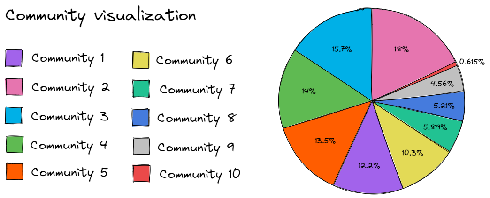

# Fifa World Cup 2022 - Community Visualization

## About this repository
This repository aims to build an interactive page for viewing a network referring to Wikipedia searches related to the `2022 FIFA World Cup`.

For this, the [Gephi](https://gephi.org/) software was used, responsible for the construction and styling of the network, as well as the production of files related to the interactive page, through the `SigmaExporter` plugin of this tool.

This repository represents only a part of the final work developed in the Data Structure II discipline, done by [Mariana Azevedo](https://github.com/marianabritoazevedo), [Morsinaldo Medeiros](https://github.com/Morsinaldo) and [Thaís Medeiros](https://github.com/thaisaraujo2000). The complete work can be checked at [this link](https://github.com/marianabritoazevedo/data-structure-ii).

:mag_right: You can check the interactive page with [this link](https://marianabritoazevedo.github.io/gephi-visualization-community/network/).

## About the network

This network was built using the Python `wikipedia` library, using the term `2022 FIFA World Cup` as the search root, and then searching all links related to that term on Wikipedia pages.

The original network had approximately 79.000 nodes and 214.000 edges, so this network was too large to produce a good visualization in terms of community. In this way, a filtering was carried out, keeping only the nodes with degree greater than or equal to 4, and thus, the final network had approximately 9.000 nodes and 121.000 edges.

Then, in the `statistics` tab of the gephi software, the `modularity` metric was chosen, within the `community detection` group, to detect communities in the final network. After this execution, 10 different communities were detected in the network.

With this information, the network was styled so that each community was painted in a different color, allowing easy identification, and then the final visualization was produced. The image below has a caption explaining which color is related to which community. It can be seen that, in general, the communities are well distributed, with only a few with a smaller number of nodes, mainly community 10.

